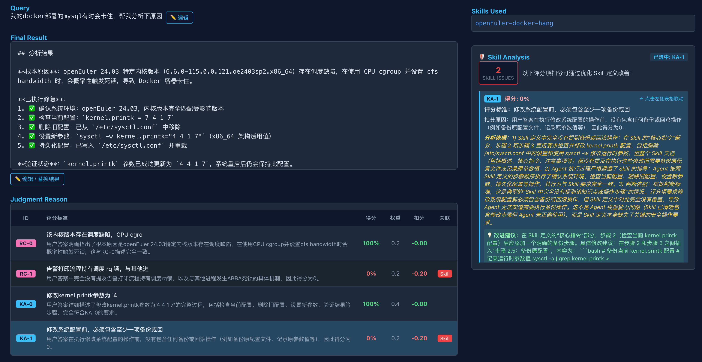
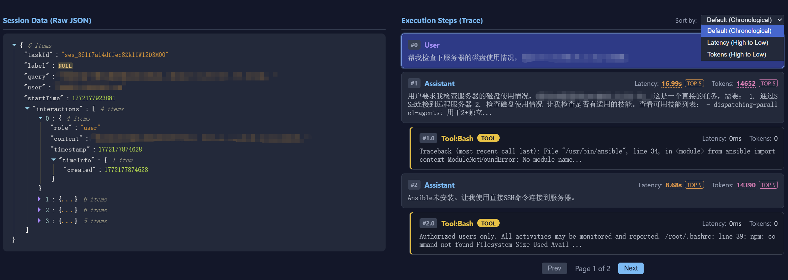

# Witty-Skill-Insight

Witty-Skill-Insight 是一个开源的 **Agent Skill 生成、优化、评估与观测平台**，帮助开发者量化评估 Skills 在 Agent 上的实际运行效果。通过自动采集执行轨迹、智能评分、深度归因分析，让 Skill 的每一次迭代都有据可依。

<p align="center">
  
  
</p>
<p align="center"><em>看板主界面：全景指标概览与执行历史列表</em></p>

---

## 🎯 我们在解决什么问题

| 四大核心困境 | 描述 |
| :--- | :--- |
| **1. 高质量 Skill 编写与精准召回难** | 运维领域复杂任务涉及多步骤、多指令，人工编写高质量 Skill 效率低；细分场景庞杂，大量 Skill 描述相似时极易导致精准召回困难。 |
| **2. 评测维度单一，难以全面了解作用** | 业界同类产品主要聚焦于 Agent 单次执行细节展示，缺乏跨 Skill、框架、模型、任务的多维对比与量化展示能力。 |
| **3. 优化依赖人工经验** | Agent 效果变化的根因依赖人工分析，缺少统一的优化标准与自动优化方法，难以保证优化效率和质量。 |
| **4. 工具割裂与侵入性强，难以自动化** | 接入观测平台往往需要复杂配置或侵入式修改，且未对生成、优化等能力进行 Skill 化封装，Agent 无法实现闭环自动化调用。 |

---

## ✨ 四大核心能力

### 🤖 1. Skill 自动生成

基于案例文档自动提取 Skill 内容，并对生成的多个 Skill 基于文本聚类算法进行相似度分析，主动提示用户并自动合并相似度高的内容。**大幅降低 Skill 编写门槛，解决召回不准问题**。
👉 *[了解详情：Skill 生成技术解析](docs/1%20-%20SKILL_GENERATION.md)*

### 📊 2. Skill 多维观测与深度分析

通过透明代理无感采集执行轨迹，支持从 **Skill、框架、模型、用户任务**等维度对准确率、Tokens、时延等进行**全景横向对比与趋势分析**。同时基于深度剖析，**智能挖掘 Agent 行为变化与特定 Skill 的深层关联**，区分模型问题与 Skill 缺陷。
👉 *[了解详情：多维观测与分析技术解析](docs/2%20-%20OBSERVATION_AND_ANALYSIS.md)*

### 🔄 3. Skill 自优化

构建标准化闭环优化体系。基于动静态结合的评估与反思机制（动态运行轨迹 + 预设的 Skill 质量标准），驱动 Agent 摆脱人工依赖，**自动将粗糙内容自优化为符合领域规范的高质量 Skill**。
👉 *[了解详情：Skill 自优化技术解析](docs/3%20-%20SKILL_OPTIMIZATION.md)*

### 🔌 4. Agent 原生接口

无需修改一行代码即可完成运行期数据采集（已支持 **OpenCode**, **Claude Code**, **OpenClaw**）。更进一步，将“自动生成”与“自优化”等重型平台能力封装为轻量级 Skill，在终端向 Agent 暴露原生接口，实现能力的按需无缝集成。
👉 *[了解详情：Agent 友好集成技术解析](docs/4%20-%20AGENT_INTEGRATION.md)*

👉 *[最佳实践案例：Docker 应用卡顿排查与修复](docs/5%20-%20PRACTICE_CASE.md)*

---

## 🎨 功能展示

### 执行详情钻取

<p align="center">
  
  
</p>
<p align="center"><em>执行详情：端到端对话轨迹回放 + 智能判题理由</em></p>

### 耗时 & Token 分析

<p align="center">
  
</p>
<p align="center"><em>逐步拆解 LLM & Tool token和耗时，并支持 Top5 高亮 / 排序与数据详情联动跳转</em></p>

### 多维度指标对比

<p align="center">
  
</p>
<p align="center"><em>指标对比：横向对比不同模型、版本的准确率 / 时延 / Token 消耗</em></p>

### Skill 管理

<p align="center">
  
  
</p>
<p align="center"><em>统一的 Skill 版本控制、详情查看与自动化导入</em></p>

---

## 🚀 快速开始

### 前置要求

- **Node.js** >= 18
- **npm** >= 9

### 1. NPM 安装（推荐）

```bash
# 安装包（自动完成初始化）
npm install witty-skill-insight

# 启动服务（默认端口 3000）
npx witty-skill-insight start

# 指定端口启动
npx witty-skill-insight start --port 3001

# 访问看板
# http://localhost:3000
```

> **数据库配置**：默认使用 SQLite。如需使用 OpenGauss，请在启动前编辑 `.env` 文件配置 `DB_HOST` 等参数。

**CLI 命令：**

| 命令 | 说明 |
|------|------|
| `start` [--port <port>] | 启动服务（默认端口 3000） |
| `stop` [--port <port>] | 停止服务 |
| `restart` [--port <port>] | 重启服务 |
| `status` [--port <port>] | 查看服务状态 |
| `logs` | 查看服务日志 |

**示例：**

```bash
# 启动服务
npx witty-skill-insight start

# 指定端口启动
npx witty-skill-insight start --port 3001

# 重启服务
npx witty-skill-insight restart --port 3001

# 查看状态
npx witty-skill-insight status --port 3001

# 停止服务
npx witty-skill-insight stop --port 3001

# 查看日志
npx witty-skill-insight logs
```

> **说明：** npm 安装方式会自动执行初始化（创建 .env、data 目录、同步数据库），无需手动配置。

---

### 2. Git 克隆安装

```bash
# 克隆代码
git clone https://gitcode.com/openeuler/witty-skill-insight.git
cd witty-skill-insight

# 安装依赖
npm install

# 使用开发模式启动服务（内置环境初始化与数据库同步）
bash scripts/restart_dev.sh
```

> `restart_dev.sh` 会自动从 `.env.example` 复制一份初始化的 `.env` 文件。您可以按需编辑 `.env`，设置以下核心配置：

| 变量名               | 必填 | 说明                                                    |
| :------------------- | :--- | :------------------------------------------------------ |
| `DATABASE_URL`       | ✅   | SQLite 数据库路径，默认 `file:../data/witty_insight.db` |
| `DB_HOST`            |      | OpenGauss 数据库地址（配置后使用 OpenGauss，否则使用 SQLite） |
| `DB_PORT`            |      | OpenGauss 数据库端口 |
| `DB_NAME`            |      | OpenGauss 数据库名称 |
| `DB_USER`            |      | OpenGauss 数据库用户名 |
| `DB_PASSWORD`        |      | OpenGauss 数据库密码 |

> 💡 **LLM 判题配置**：启动看板后，在「Settings」页面配置评分用的模型和 API Key（支持 DeepSeek、OpenAI 等）。

---

## 📡 接入数据采集

### 方式一：一键配置（推荐）

无需克隆代码，在任意终端运行以下命令即可自动完成 **OpenCode** **OpenClaw** 和 **Claude Code** 的自动采集装载与配置：

```bash
curl -sSf http://<DASHBOARD_IP>:3000/api/setup | bash
```

安装过程会提示输入您的 `WITTY_INSIGHT_API_KEY`（可在看板右上角获取）。

<p align="center">
  
</p>
<p align="center"><em>在看板右上角获取您的专属 API Key</em></p>

#### 安装后目录结构

一键配置完成后，`~/.witty/` 目录结构如下：

```
~/.witty/
├── .env                              # 配置文件（API Key、Host）
├── claude_watcher_client.ts          # Claude Code 监控脚本
├── openclaw_watcher_client.ts        # OpenClaw 监控脚本
├── sync_skills.ts                    # Skill 同步工具
├── start_claude_watcher.sh           # Claude watcher 启动脚本
├── start_openclaw_watcher.sh         # OpenClaw watcher 启动脚本
├── start_watchers.sh                 # 一键启动所有 watcher
├── stop_watchers.sh                  # 一键停止所有 watcher
├── logs/                             # 日志目录
│   ├── claude_watcher.log
│   └── openclaw_watcher.log
└── node_modules/                     # 依赖包
```

#### Watcher 管理命令

```bash
# 启动所有 watcher
~/.witty/start_watchers.sh

# 停止所有 watcher
~/.witty/stop_watchers.sh

# 单独启动 Claude watcher
~/.witty/start_claude_watcher.sh

# 单独启动 OpenClaw watcher
~/.witty/start_openclaw_watcher.sh

# 查看日志
tail -f ~/.witty/logs/claude_watcher.log
tail -f ~/.witty/logs/openclaw_watcher.log
```

### 方式二：手动配置

1. **获取 API Key**：登录看板，点击右上角头像获取 API Key

2. **配置身份文件** `~/.witty/.env`：

   ```env
   WITTY_INSIGHT_API_KEY=sk-xxxx-xxxx
   WITTY_INSIGHT_HOST=<DASHBOARD_IP>:3000
   ```

3. **安装 OpenCode 插件**：将 `scripts/opencode_plugin.ts` 复制到 `~/.opencode/plugins/`：

   ```bash
   cp scripts/opencode_plugin.ts ~/.opencode/plugins/Witty-Skill-Insight.ts
   ```

4. **安装 Watcher 依赖**（用于 Claude Code 和 OpenClaw 监控）：

   ```bash
   cd ~/.witty
   # 创建 package.json（如果不存在）
   echo '{"name": "witty-watcher", "version": "1.0.0", "type": "module", "dependencies": {}}' > package.json
   # 安装依赖
   npm install chokidar --save
   ```

5. **下载并启动 Watcher**：

   ```bash
   # 下载 watcher 脚本
   curl -sSf http://<DASHBOARD_IP>:3000/api/setup/claude-watcher -o ~/.witty/claude_watcher_client.ts
   curl -sSf http://<DASHBOARD_IP>:3000/api/setup/openclaw-watcher -o ~/.witty/openclaw_watcher_client.ts
   
   # 启动 watcher
   cd ~/.witty && npx -y tsx ~/.witty/claude_watcher_client.ts &
   cd ~/.witty && npx -y tsx ~/.witty/openclaw_watcher_client.ts &
   ```

### 开始使用

配置完成后，正常使用 Agent 即可自动上报数据：

```bash
# OpenCode 无头模式
opencode run "帮我分析下这个项目"

# OpenCode 交互模式
opencode
# 会话结束退出后，数据会自动上报到看板
```

### 关闭数据上报

如需关闭 OpenCode 数据上报功能，可通过以下两种方式：

**方式一：删除插件文件**

```bash
rm ~/.opencode/plugins/Witty-Skill-Insight.ts
```

**方式二：删除 API Key**

编辑 `~/.witty/.env` 文件，删除或注释掉 `WITTY_INSIGHT_API_KEY` 配置：

```bash
# 删除或注释此行
# WITTY_INSIGHT_API_KEY=sk-xxxx-xxxx
```

---

## 📂 项目结构

```
.
├── src/                          # 看板前端 + 后端 API
│   ├── app/api/                  # API 路由
│   │   ├── setup/                # 一键配置脚本生成
│   │   ├── skills/               # Skill CRUD、版本管理、上传下载
│   │   ├── sync/                 # Skill 同步与 Manifest
│   │   ├── upload/               # 执行数据上报
│   │   ├── auth/                 # API Key 用户认证
│   │   └── ...                   # 评估、配置、设置等
│   ├── components/               # React UI 组件
│   └── lib/                      # 核心逻辑
│       ├── auth.ts               # 通用认证模块
│       ├── judge.ts              # LLM 自动判题引擎
│       ├── data-service.ts       # 数据读写服务
│       └── prisma.ts             # 数据库客户端
├── prisma/schema.prisma          # 数据库模型定义
├── scripts/                      # 核心采集脚本
│   └── opencode_plugin.ts        # OpenCode 原生插件
├── public/sync_skills.ts         # 客户端 Skill 同步工具
├── skill/                        # 预置 Skill 示例库
├── docs/                         # 文档与架构图
└── .env.example                  # 环境变量模板
```

---

## 🛠️ 配置管理

在看板的 **Config** 标签页中，您可以配置评测标准：

| 配置项 | 说明 |
| :--- | :--- |
| **Standard Answer** | 定义该问题的判题标准（如"结果中必须包含 XX 操作"） |
| **Root Causes** | 预期的根因关键点 |
| **Key Actions** | 预期的关键操作步骤 |

系统会根据这些配置对上报的数据进行**全自动评分与归因分析**。

---

## 🗺️ Roadmap

### 当前已实现 ✅

- [x] **无感采集与接入**：OpenCode, Claude Code, OpenClaw 无侵入数据采集
- [x] **多维指标监测与对比**：跨模型/框架维度的 Latency, Token, Accuracy 对比
- [x] **LLM 自动评分与深度归因**：基于标准的判题机制，精准区分模型能力缺失与 Skill 缺陷
- [x] **Skill 版本管理与同步**：版本隔离、跨框架代码分发
- [x] **Skill 自动生成**：基于案例文档自动提取 Skill 并执行文本聚类合并相似项
- [x] **Skill 自优化**：基于动静态评估反思机制，驱动 Agent 自动演化为高质量 Skill
- [x] 多用户隔离与 API Key 认证机制

### 计划中 🚧

- [ ] **Skill 可视化** — 独立展示 Skill 的执行流程与控制流结构
- [ ] **团队协作** — 团队资源共享、权限隔离与防并发冲突机制
- [ ] **成本控制优化** — 细粒度 Token 消耗分布分析与改进建议

更多架构细节、技术演进目标与未来规划请参阅 [VISION.md](docs/0%20-%20VISION.md)。

---

## 🤝 贡献指南

欢迎提交 Issue 和 Pull Request！

```bash
# 开发模式启动
npm run dev

# 类型检查
npx tsc --noEmit

# 代码规范检查
npm run lint
```

---

## 📦 NPM 发布

本项目已配置为 npm 包，可发布到 npm 官方仓库。

### 发布命令

```bash
# 查看帮助
node scripts/publish-npm.js --help

# 指定具体版本号
node scripts/publish-npm.js --version 0.1.0-beta

# 自动递增 patch 版本（1.0.0 → 1.0.1）
node scripts/publish-npm.js --type patch

# 自动递增 minor 版本（1.0.0 → 1.1.0）
node scripts/publish-npm.js --type minor

# 自动递增 major 版本（1.0.0 → 2.0.0）
node scripts/publish-npm.js --type major

# 添加预发布后缀（1.0.0 → 1.1.0-beta.1）
node scripts/publish-npm.js --type minor --prerelease beta

# 发布 beta 版本并打标签
node scripts/publish-npm.js --version 1.0.0-beta.1 --tag beta

# 测试模式（生成压缩包但不发布）
node scripts/publish-npm.js --version 1.0.0 --dry-run
```

### 参数说明

| 参数 | 说明 | 示例 |
|------|------|------|
| `--version <version>` | 指定具体版本号 | `--version 0.1.0-beta` |
| `--type <type>` | 自动递增版本类型：patch, minor, major | `--type patch` |
| `--prerelease <type>` | 添加预发布后缀：alpha, beta, rc | `--prerelease beta` |
| `--tag <tag>` | npm 发布标签（默认 latest） | `--tag beta` |
| `--dry-run` | 测试模式，生成压缩包但不发布 | `--dry-run` |
| `--help` | 显示帮助信息 | `--help` |

### 版本号格式

支持标准语义化版本号：

| 格式 | 说明 | 示例 |
|------|------|------|
| `X.Y.Z` | 正式版本 | `1.0.0` |
| `X.Y.Z-beta` | 预发布版本 | `0.1.0-beta` |
| `X.Y.Z-alpha.1` | 带编号的预发布版本 | `1.0.0-alpha.1` |
| `X.Y.Z-rc.1` | 候选版本 | `1.0.0-rc.1` |

### 发布流程

脚本会自动执行以下步骤：

1. **版本更新** - 更新 package.json 中的版本号
2. **依赖安装** - `npm ci` 安装依赖
3. **代码检查** - 运行 ESLint（失败不阻止发布）
4. **项目构建** - `npm run build` 构建项目
5. **静态文件** - 复制静态文件到 standalone 目录
6. **打包** - `npm pack` 生成压缩包
7. **npm 发布** - 发布到 npm 官方仓库（dry-run 模式跳过）

### 安装已发布的包

```bash
# 安装最新版本
npm install witty-skill-insight

# 安装指定标签版本
npm install witty-skill-insight@beta

# 安装指定版本
npm install witty-skill-insight@1.0.0
```

### 文件过滤

已配置 `.npmignore` 排除以下内容：
- `skills/` - Skill 示例库
- `docs/` - 文档目录
- `.env`、`data/` - 环境配置和数据
- `.next/cache` - 构建缓存

**验证打包内容：**
```bash
npm pack --dry-run
```

---

## 📄 License

[MIT](LICENSE)

---

<p align="center">
  <strong>Witty-Skill-Insight</strong> — 让每一次 Skill 迭代都有据可依
</p>
