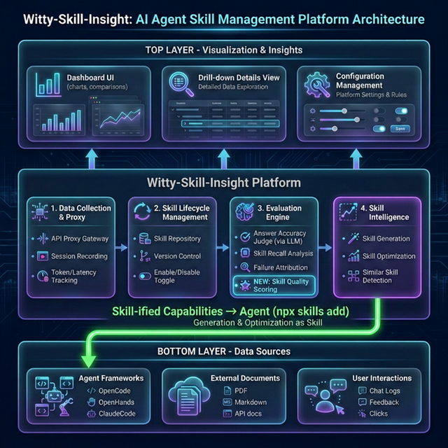

# Witty-Skill-Insight：从"感觉"到"量化"的进化之路

## 1. 背景：Agent使用Skill的四大困境

随着 Agent 技术的演进，我们正通过 **Skills** 赋予 LLM 实际行动的能力。Skill 已经成为 Agent 解决复杂问题的新时代大脑，其质量直接决定了 Agent 的上限。

然而，**Skill 从编写到运行的全生命周期中，开发者面临着四大核心困境**：

1. **高质量 Skill 编写与精准召回难**：以运维领域为例，复杂任务存在大量步骤与脚本，人工编写高质量 Skill 效率低；加之运维细分场景庞杂，大量 Skill 描述信息相似时，又极易导致精准召回困难。
2. **评测维度单一，难以全面了解 Skill 的作用**：当前业界同类产品主要聚焦于对于 Agent 一次执行细节的展示，缺乏多维度（如：Skill、框架、模型、用户任务）指标（准确率、时长、tokens）的全面对比展现。
3. **优化依赖人工经验**：Skill 优化依赖于人工经验，缺少统一的优化标准与自动优化方法，难以保证优化效率和质量。
4. **工具割裂与侵入性强，难以实现全流程自动化**：当前业界同类产品不仅采集 Agent 数据往往需要复杂配置或侵入式修改，未进行Skill化封装的生成、优化等能力，Agent 无法实现闭环调用。这导致操作过程中需要大量的人工介入和工具切换，割裂了 Agent 自动化的全流程。

**没有量化，就没有优化。** 这就是 Witty-Skill-Insight 存在的根本意义。它不仅要打开这个黑盒，更要**直观展示 Skill 优化前后，端到端的实际效果对比**。

## 2. 核心价值：从"体感评估"到"精准量化"

为了应对上述挑战，我们需要一套严谨的评估体系来透视 Agent 的行为。这套体系建立在**三个黄金指标**之上：

1. **效果 (Effectiveness) - 准确率**：
   Agent 是否真的解决了问题？结果是否可信？（不仅仅是看它说了什么，更要看它做了什么）。这是 Agent 存在的基石。
2. **效率 (Efficiency) - 时延**：
   解决问题的速度是否可接受？在生产运维场景中，响应时间直接决定了故障恢复的效率和用户体验。
3. **成本 (Cost) - Token**：
   达成目标消耗了多少算力？Token 使用量是否在经济可控范围内？对上下文窗口的占用是否合理？

通过对这三大指标的持续监控与分析，我们可以让每一次执行都被直观呈现，实现评估驱动开发，让 Agent 的进化有据可依。

## 3. 四大核心能力与技术方案

为了将上述理念落地，我们构建了 **Witty-Skill-Insight**，围绕四大核心能力逐一解决关键挑战：

### 核心能力一：Skill 自动生成

**解决困境**：高质量 Skill 编写与精准召回难

**核心方案**：基于（一个或多个）案例文档自动提取 Skill 内容，并对生成的多个 Skill 基于文本聚类算法进行相似度分析，主动提示用户并自动合并相似度高的内容。这一过程不仅大幅降低了 Skill 编写门槛，同时消减了相似冗余设定，从而规避了召回准确度低的问题。（详情参考：[Skill 生成技术解析](SKILL_GENERATION.md)）

### 核心能力二：Skill 多维观测与深度分析

**解决困境**：评测维度单一，难以全面了解 Skill 的作用

**核心方案**：

- **多维对比**：支持从 Skill 版本、Agent 框架、基座模型、用户任务等多个维度，对任务准确率、Token 消耗、运行时长等关键指标进行全景横向对比与分析。
- **深度分析**：基于对 Agent 执行过程的深度逆向剖析，精准挖掘 Agent 行为变化与特定 Skill 之间的深层关联，定界排查问题根因，为后续优化提供可靠的数据依据。（详情参考：[多维观测与分析技术解析](OBSERVATION_AND_ANALYSIS.md)）

### 核心能力三：Skill 自优化

**解决困境**：优化依赖人工经验

**核心方案**：构建标准化闭环优化体系。基于动静态结合的评估与反思机制（动态运行轨迹 + 预设的 Skill 质量标准），驱动 Agent 摆脱人工依赖，自动将粗糙内容自优化为符合运维领域规范的高质量 Skill。（详情参考：[Skill 自动演化技术解析](SKILL_OPTIMIZATION.md)）

### 核心能力四：Agent 原生接口

**解决困境**：工具割裂与侵入性强，难以实现全流程自动化

**核心方案**：

- **透明代理，无感采集**：用户不用写一行代码即可开始采集运行期数据。当前已无缝支持主流的 Agent 框架：OpenCode、OpenHands、Claude Code。
- **平台能力按需下放**：将上述“自动生成”与“自优化”等重整平台能力封装为轻量级 Skill，并在原生的终端界面中提供给 Agent 调用，实现能力的按需无缝集成。（详情参考：[Agent 友好集成技术解析](AGENT_INTEGRATION.md)）

---

_只有当能力被量化，优化才变得有迹可循_

---

## 4. 统一 Skill 生命周期管理

除了上述五大核心能力，Witty-Skill-Insight 还提供统一的 **Skill 生命周期管理**：

- **集中式 Skill 仓库**：跨框架统一存储与检索（OpenCode / Claude / OpenHands）
- **版本控制**：支持多版本管理（V1, V2...）与一键回滚
- **启用/禁用**：一键控制 Skill 生效状态
- **跨框架分发**：自动同步到不同 Agent 框架的本地目录

开发者可以轻松回滚到旧版本，或对比不同版本 Skill 的表现差异，让 Skill 迭代井井有条。

---

## 5. 平台架构与功能全景

### 已实现功能

| 模块           | 功能             | 说明                                        |
| :------------- | :--------------- | :------------------------------------------ |
| **数据采集**   | 透明代理         | 兼容 OpenAI 协议，无侵入式接入              |
|                | 原生插件         | OpenCode 原生 Plugin，毫秒级上报            |
|                | 日志旁路         | Claude Code 底层日志级旁路拦截无感采集      |
|                | 会话记录         | 完整记录 Agent 执行轨迹                     |
|                | 指标追踪         | Token 消耗、延迟、成本实时统计              |
| **Skill 管理** | Skill 仓库       | 集中式 Skill 存储与检索                     |
|                | 版本控制         | 支持多版本管理与回滚                        |
|                | 启用/禁用        | 一键控制 Skill 生效状态                     |
|                | 跨框架同步       | 自动分发到 OpenCode / ClaudeCode 等         |
| **Skill 生成** | 文档提取         | 基于案例文档自动提取生成 Skill              |
|                | 相似 Skill 合并  | 基于文本聚类算法分析相似度，自动提示合并    |
| **Skill 优化** | 动静态评估与反思 | 基于运行轨迹与质量标准自动优化 Skill        |
| **评估引擎**   | 答案准确性       | 配置化评测，可信分析                        |
|                | Skill 召回       | 验证 Agent 是否使用了正确的 Skill           |
|                | 失败归因         | 逐项分析扣分原因，区分模型问题与 Skill 缺陷 |
| **可视化**     | Dashboard        | 多维度指标对比图表                          |
|                | 详情下钻         | 单次执行的完整回放                          |
|                | 配置管理         | 可视化配置标准答案与评测标准                |

### 待实现功能 (Roadmap)

| 模块             | 功能             | 说明                                                                     |
| :--------------- | :--------------- | :----------------------------------------------------------------------- |
| **Skill 管理**   | 版本对比         | 支持任选两个版本进行对比并高亮展示差异                                   |
|                  | 在线编辑         | 支持复制已有版本并在线编辑后保存为最新版本                               |
| **团队协作**     | 团队资源共享     | 支持多用户协作，团队成员可共享 Skill、数据集、执行记录等资源             |
|                  | 权限管理         | 清晰区分团队共享资源与个人私有资源                                       |
|                  | 变更通知         | 团队成员修改资源后自动通知其他成员                                       |
| **成本优化**     | 成本分布分析     | 分析执行过程中的 Token 消耗分布，给出优化建议，以更低成本达成更高准确率  |
| **反馈优化**     | 人在环路反馈     | 支持用户对执行结果进行反馈，驱动 Skill 持续改进                          |
| **Skill 可视化** | 流程可视化       | 独立展示 Skill 的执行流程                                                |
