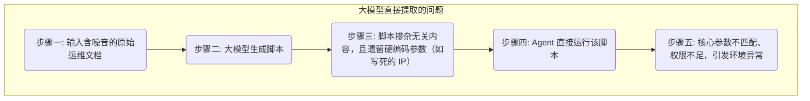

# Witty-Skill-Insight: Skill 自动生成技术解析

> **💡 核心速览（Quick Insights）**
> 
> - **🎯 解决困境** 高质量 Skill 编写与精准召回难——运维领域复杂任务存在大量步骤与脚本，人工编写高质量 Skill 效率低；大量 Skill 描述信息相似时，精准召回困难。
> - **🚀 核心功能** 专为 **OS 运维领域（如 openEuler 等操作系统调优排障）** 打造的 Skill 自动生成技术，基于案例文档自动提取 Skill 内容，并通过文本聚类算法自动分析和合并相似 Skill。
> - **⚡️ 快速上手** 在本地 Agent 工作环境执行一条命令注入组件，随后用自然语言向 Agent 下发Skill生成任务，即可在几分钟内自动生成标准Skill 包。

## 1. 问题与挑战

让 Agent 在运维领域发挥作用的关键在于为其提供高质量的操作规范和工具脚本，即 **Skill（技能包）**。在企业实际落地过程中，运维团队积累了大量经验资产：Wiki 上的操作指南、社区 Issue 记录、分散在代码仓库中的脚本片段等。将这些非结构化文档逐个转化为 Agent 可用的标准 Skill 面临两大挑战。

### 1.1 挑战一：手动编写 Skill 效率低、维护成本高

人工将非结构化的运维记录逐个翻译、编写成标准 Skill，耗时耗力；运维知识更新快，Skill 维护成本持续走高。这成为 Agent 规模化落地的重要瓶颈。

### 1.2 挑战二：直接使用大模型提取存在代码幻觉风险

如果简单地将运维文档交给基础大模型提取，会引发一系列代码安全风险。例如，一篇关于 `openEuler` 网络调优的文档中，不仅包含核心代码，还夹杂广告链接和讨论内容；脚本中还可能写死了内网 IP（如 `192.168.1.1`）和特定网卡 `eth0`，并假定 root 权限。

大模型直接提取的典型问题链条如下：



当 Agent 在生产环境中调用这样的脚本时，极易因参数不匹配或权限不足导致系统故障。

### 1.3 我们的方案：自动化分层重构流水线

为了安全、批量地将非结构化知识转化为可靠的 Agent Skill，Witty-Skill-Insight 构建了一条 **Skill 自动生成流水线**。

该流水线针对操作系统运维（OS）场景的高安全性要求做了专项加固。系统不仅自动识别并清理干扰噪音，在生成核心代码时，还会自动将硬编码值剥离为可配置参数，并强制嵌入前置校验逻辑（如特权检查、环境探测等）。

最终产出的是一份自带异常处理和兼容性保障的标准 Skill 资产包。

---

## 2. 使用方式与快速上手

尽管底层运行的是一条复杂的 AI 流水线，但用户层面的操作非常简洁：

1. **安装生成组件**：
   在当前 Agent CLI 环境中引入远程生成组件：
   ```bash
   npx skills add https://gitcode.com/leon-wang2021/skill-insight-client.git
   ```
2. **使用自然语言发起生成指令**：
   安装完成后，该组件即成为 Agent 的一项内建能力。将文档路径或链接提供给 Agent，用自然语言指挥即可：
   > "根据案例文档：<案例文档路径或者链接>生成一个Skill"

3. **生成完毕自动就绪**：Agent 完成后，相关目录下将生成完整的 Skill，包含规范化的入参出参配置、主运行文件及前置校验逻辑，可被 Agent 直接识别和使用。

---

## 3. 核心技术原理

为保证生成的 Skill 在生产环境中安全可用，我们采用分步骤的流水线机制，而非简单的"文档直接提取"。流水线主要分为以下三步：

### 3.1 第一步：数据清洗与噪音过滤
原始运维文档通常夹杂广告、HTML 标签、个人讨论等无关信息。
- **清洗干扰项**：在发送给大模型前，使用正则等规则剥离无效信息，降低模型的理解负担。
- **锁定关键配置词**：对于操作系统相关的高危参数（如 `/etc/sysctl.conf`、`tcp_tw_reuse`），预先标记为不可篡改项。确保大模型在提炼代码时不会错误简写或篡改这些关键配置。

### 3.2 第二步：将一次性脚本改造为通用 Skill
提取出的代码片段通常带有原始环境的硬编码痕迹，需要重构为通用工具。
- **硬编码自动参数化**：系统自动扫描脚本中写死的特定值（如网卡 `eth0`、测试 IP `192.168.1.1`），将其替换为可配置的系统变量（如 `$NIC_NAME`），使脚本具备跨环境通用性。
- **强制注入运行保护**：针对 Bash 脚本，自动插入防护指令（如 `set -eo pipefail`），确保任何一行执行报错时脚本立即中止，避免连锁故障。

### 3.3 第三步：格式组装与输出校验
Agent（如 Claude Code）在加载 Skill 时，需要格式严格的 `meta.yaml` 配置文件。直接让大模型生成 YAML 容易出现缩进或格式错误，导致 Agent 加载失败。
- 生成阶段仅要求返回纯数据节点（入参列表、参数说明等结构化数据）。
- 本地组件接收数据后，通过强类型代码严格组装 YAML 文件，从根本上消除因大模型格式输出不稳定导致的加载错误。
