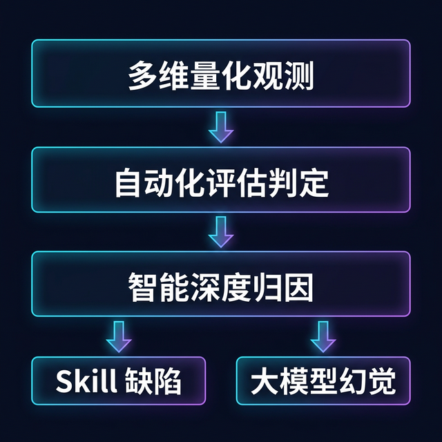

# Witty-Skill-Insight: Skill 多维观测与深度分析技术解析

在运维场景中，随着Agent能力的提升，越来越多的复杂排障、调优工作交由 Agent 完成。然而，这种高度自动化的模式也引入了新的工程挑战：**当 Agent 执行失败时，难以低成本地定位问题的根本原因。**

本文将通过一个具体的排障案例，探讨 Agent 工程落地中的观测与评估难题，并介绍 Witty-Skill-Insight 如何通过"多维观测与深度分析"技术解决这些问题。



---

## 1. 问题与挑战：一个 Agent 排障失败引发的困局

在传统软件开发中，可以通过单元测试的断言来准确判断代码是否按预期工作。但 Agent 的行为由自然语言提示词和动态思维链驱动，其执行过程具有高度的**非确定性**。

**【案例：内核异常排障测试】**
一个运维团队开发了一个用于排查 `openEuler` 节点内存泄漏的 Skill，并交由 Agent 在测试环境中进行回归测试。
*   **测试期望：** Agent 读取 `/proc/meminfo`，发现异常后通过调整 `sysctl` 参数进行缓解。
*   **测试结果：** Agent 执行失败，并引发了其他基础服务的异常中断。

此时，如果缺乏有效的观测和分析工具，团队将面临典型的**归因困局**：
1.  **是底座大模型能力不足？** 模型可能在多轮对话后遗忘了关键约束指令（注意力丢失或幻觉）。
2.  **是 Skill 定义有缺陷？** 可能是 Skill 中没有写清特定内核版本下的执行条件，或缺少关键的前置依赖配置。
3.  **如何低成本地批量验证？** 每次修改 Skill 后，不可能都靠工程师逐行检查 Agent 的对话日志和终端输出来人工打分。

**痛点总结：**
*   **评测维度单一：** 当前业界同类产品主要聚焦于 Agent 单次执行细节的展示，缺乏多维度指标（Skill、框架、模型、用户任务）的全面对比。
*   **故障归因定界难：** Agent 执行过程是黑盒，难以界定问题根因是模型推理缺陷还是 Skill 规则漏洞。
*   **人工评估成本高：** 日志冗长，人工检查成本高且主观性强，无法支持大规模评测。

### 1.1 我们的方案：多维观测与深度分析体系

为解决上述问题，Witty-Skill-Insight 构建了一套完整的多维观测与深度分析体系，核心价值如下：

*   **精确的故障归因与定界：** 通过还原 Agent 执行轨迹进行深度溯源，明确界定失败根因——是底层大模型推理的幻觉，还是上层 Skill 逻辑定义的缺陷，为后续优化指明方向。
*   **自动化的大规模评估：** 引入低门槛的自然语言测试基准定义，借助 AI 评估引擎自动化完成大规模测试的客观打分与校验，替代人工日志排查。
*   **可视化的多维度量：** 建立涵盖执行精准度、端到端时效和计算成本的多维量化指标，支持从 Skill 版本、Agent 框架、基座模型、用户任务等多个维度进行横向对比分析。

---

## 2. 使用方式

Witty-Skill-Insight 将复杂的底层分析过程进行了封装，向用户提供了一套简洁的交互流程：

### 前置安装：一键打通 Agent 与 Insight 数据通路

在任意终端执行以下命令，按照交互式引导完成配置后，Agent 的运行数据即可自动上报至 Insight 平台：

```bash
curl -sSf http://<DASHBOARD_IP>:3000/api/setup | bash
```

### 步骤一：定义评估数据集

在 Insight 的「数据集管理」中配置评估基准。用户只需提供以下信息：

- **问题（必填）**：设定要考核 Agent 的任务描述或故障场景
- **标准答案 或 案例文档（二选一）**：提供该场景的预期解决方案文本，或直接上传一篇案例文档

系统内置的 AI 提取引擎会自动从您提供的内容中提炼出关键根因、必要操作步骤等量化评分点，无需手动配置评分规则。

### 步骤二：正常使用 Agent 执行任务

数据集定义完成后，使用您日常的 Agent 工具（OpenCode、Claude Code 等）正常执行数据集中定义的任务即可。运行期数据会通过前置安装阶段配置好的通路自动上报，全程无需额外操作。

```bash
# 示例：使用 OpenCode 执行任务
opencode run "排查当前节点的 inode 耗尽告警，找出占用最多的前三个目录"
```

### 步骤三：查看执行过程与深度分析结果

任务执行完毕后，登录 Insight 平台即可查看完整的结果与分析报告，包括：
- **自动评分**：AI 评估引擎基于预设基准自动完成打分
- **多维对比**：从 Skill、框架、模型等维度横向对比关键指标
- **归因分析**：对失败任务提供明确的归因结论，例如：
  *   👉 *【归因结论：Skill 缺陷】"Agent 尝试执行磁盘探针命令时抛出 `command not found`。原因：Skill 中缺少要求 Agent 预先检查并安装对应依赖包的指导指令。"*

根据归因结果，可进一步引入平台优化组件，让 Agent 自动修补 Skill 缺陷，完成闭环优化。

---

## 3. 关键技术原理

为实现上述能力，Witty-Skill-Insight 在底层构建了以下三大核心技术模块：

### 3.1 核心一：面向 Agent 的多维观测指标体系
传统 DevOps 监控主要关注 CPU、内存等系统指标。Witty-Skill-Insight 针对 Agent 运行特征，定义了三大核心观测维度：
1.  **执行精准度 (Effectiveness)**：不仅评判大模型的文本回答，更重点提取并校验其实际调用的 API 序列和命令行工具流，判定操作是否准确、是否存在冗余步骤。
2.  **端到端时效 (Efficiency)**：测算从任务注入到最终输出结论的完整耗时，包括上下文加载、多轮思维链交互等各阶段，评估 Agent 在生产场景的响应能力。
3.  **计算成本 (Token Cost)**：精确记录不同 Skill 在加载时对大模型上下文窗口的占用量，帮助识别并精简导致成本过高的冗余 Skill 描述。

### 3.2 核心二：基于 LLM 的自动化评测
为解决大规模人工评测成本高的问题，系统引入了 LLM-as-a-Judge 的技术架构。
评估引擎接收开发者输入的自然语言测试基准（见"步骤一"），将其解构为带有权重和优先级的**内部评分规则树**。
测试完成后，引擎将采集到的底层执行轨迹（包括每个命令调用和返回结果）与规则树进行比对，提供客观、一致、可重复的大规模打分，并将每个扣分点回溯至具体的操作指令。

### 3.3 核心三：靶向归因分析模块
一个简单的"测试不通过"标签对解决问题没有帮助。靶向归因模块通过错误链回溯和语义分析，将导致失败的根因清晰地分离为两类：
*   **归因于 Skill 逻辑缺陷**：执行轨迹显示 Agent 因组件参数未设定版本兼容性边界、或前置依赖遗漏导致环境报错。系统将问题定界在 Skill 定义层面，并给出具体修订建议。
*   **归因于大模型推理缺陷**：排障文档中已明确约束"不允许执行破坏性操作"，而模型在多轮交互后仍生成了越权指令。系统出具客观数据，判定底座模型存在安全遵循缺陷，为模型选型决策提供数据支撑。

**总结：Witty-Skill-Insight 通过"多维指标量化 + 自动化评估 + 靶向归因分析"的完整链路，让 Agent 的测试、评估与优化从人工经验驱动转向数据驱动。**
