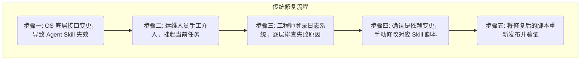

# Witty-Skill-Insight: Skill 自优化技术解析

> **💡 核心速览（Quick Insights）**
> 
> - **🎯 解决困境** 优化依赖人工经验——Skill 优化缺少统一标准与自动化方法，依赖人工经验，效率和质量难以保证。
> - **🚀 核心功能** 基于**动静态结合的自优化机制**（动态运行轨迹 + 预设的 Skill 质量标准），构建标准化闭环优化体系，驱动 Agent 自动将粗糙内容优化为符合运维领域规范的高质量 Skill。
> - **⚡️ 快速上手** 在工作环境中用一条命令安装优化器组件，当 Agent 因环境故障中止时，用自然语言指示其调用优化器自行修复并重试。

## 1. 问题与挑战

在基于 Agent 的自动化运维体系中，Skill（技能包）是 Agent 从"对话助手"升级为"数字运维工程师"的核心要素。然而，即使初始 Skill 编写规范，部署到真实生产环境后仍会面临两大挑战：

### 1.1 挑战一：静态代码中的潜在逻辑缺陷

运维排障脚本在编写时，由于经验盲区，往往缺少对底层依赖的完整校验逻辑。例如，一个卸载内核模块的脚本没有预先校验该模块是否已加载。在正常环境下可能不报错，但遇到状态异常的节点时，会直接导致 Agent 工具调用链中断。这类先天缺陷潜伏在代码中，难以通过静态审查发现。

### 1.2 挑战二：动态环境漂移导致 Skill 失效

有一个 Agent 长期负责集群的 CPU 内存分配诊断。当集群统一升级了 openEuler 操作系统大版本后，部分底层接口或动态链接库名称发生变更。此时 Agent 调用原有 Skill 时，会因路径或接口不匹配而失败。

传统的修复流程如下：



这种流程不仅恢复周期长，还消耗大量研发资源在基础设施排查上，与"减少人工干预"的自动化目标相悖。

### 1.3 我们的方案：动静态结合的自优化体系

为从根本上解决 Skill 因代码缺陷或环境变化而失效的问题，Witty-Skill-Insight 构建了**动静态结合的自优化体系**。

当 Skill 执行异常时，底层采集探针自动捕获包含失败轨迹的运行快照。这些数据传导给两大优化引擎：静态检查引擎负责排查格式和基础语义问题；动态反思引擎基于运行轨迹分析失败原因，精确定位问题代码并进行定点修补。

这使得 Agent 具备了在失败中自我修复并持续增强的能力，显著降低了运维团队的人工干预成本。

---

## 2. 使用方式与快速上手

整个优化流程被压缩为终端内的几步操作：

1. **安装自优化组件**：
   在需要自修复能力的终端环境中运行：
   ```bash
   npx skills add https://gitcode.com/leon-wang2021/skill-insight-client.git
   ```
2. **故障时即时指挥修复**：
   当 Agent 因依赖库不兼容等问题终止操作时，无需人工分析错误日志，直接在终端下达指令：
   > "根据执行记录，优化一下 xx Skill，然后用修复后的 Skill 重新执行任务。"
3. **自动完成修复**：引擎在短时间内完成分析和修补（例如在脚本中注入适配新版 openEuler 的环境探测函数），后续相同场景的执行不再受同一问题影响。

---

## 3. 核心技术原理

在代码自修复过程中，如果直接将整个报错脚本交给大模型重写，容易因幻觉导致原本正常的代码被误改。为此，Witty 在底层架构上设计了两大互补的优化引擎：

### 3.1 静态检查引擎：运行前的多维质量检查

所有 Skill 在被 Agent 正式运行前，必须通过静态检查：

* **格式与安全扫描**：不依赖大模型，而是利用代码检查器强制检查配置文件（如 YAML）的格式正确性，扫描是否存在 `rm -rf /*` 等未经限制的高危指令。
* **逻辑漏洞排查**：在格式正确的基础上，检查代码的逻辑完整性。例如，发现某行代码试图释放一个未定义的变量时，引擎直接拦截并要求修正。

### 3.2 动态反思引擎：运行失败后的定点修复

当 Skill 通过了静态检查，但在真实环境中因依赖缺失等问题运行失败时，动态引擎介入：

* **崩溃日志分析**：底层无感采集探针截获系统级报错信息，系统从中提取核心症结，生成结构化的缺陷诊断报告（例如：定位到错误原因是缺失了某版本的 `.so` 库文件）。
* **精确到行的局部代码修补**：基于诊断报告，系统仅锁定失效的代码块进行定点修补（例如只在报错函数中添加依赖探测逻辑），不触及其他正常代码。这种"局部修补而非全量重写"的策略确保了修复的安全性和精确性。
