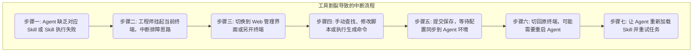

# Witty-Skill-Insight: Agent 原生接口技术解析

> **💡 核心速览（Quick Insights）**
> 
> - **🎯 解决困境** 工具割裂与侵入性强，难以实现全流程自动化——采集 Agent 数据需要复杂配置或侵入式修改；未进行 Skill 化封装的生成、优化等能力，Agent 无法直接闭环调用，导致大量人工介入和工具切换。
> - **🚀 核心功能** 提供**无感采集**与**平台能力 Skill 化封装**两大机制。无需写一行代码即可采集 Agent 运行数据；同时将生成、优化等平台能力封装为标准 Skill，让 Agent 在终端内直接调用，实现全流程自动化闭环。
> - **⚡️ 快速上手** 在 Agent 终端环境中执行一行命令即可完成能力注入：
>   `npx skills add https://gitcode.com/leon-wang2021/skill-insight-client.git`

---

## 1. 问题与挑战

在多智能体协作与复杂基础设施运维（如 openEuler 大规模集群维护）的实践中，赋予 Agent 自动化能力需要数据采集和工具整合的支撑。但现有架构在这两方面存在明显不足。

### 1.1 挑战一：工具割裂，全流程被人工切断

当 Agent 在终端中执行排障任务时发现自身 Skill 不足或过时，如果生成、优化等能力没有被封装为 Agent 可直接调用的 Skill，修复过程会极其冗长：



这种"遇到问题后必须退出当前环境手动操作"的流程，需要大量的人工介入和工具切换，割裂了 Agent 自动化的全流程。

### 1.2 挑战二：数据采集侵入性强

获取 Agent 运行数据是观测和评估的前提，但传统采集方式存在高侵入性问题：

- **需要侵入式埋点**：传统可观测性方案需要在 LLM 请求层或脚本层手工插入日志采集代码。
- **闭源 Agent 无法介入**：面对高度封装的商业 Agent（如 Claude Code、OpenHands），底层代码不开放，无法注入监测逻辑，出现问题时无据可查。

### 1.3 我们的方案：原生接口架构

针对上述痛点，Witty-Skill-Insight 落地了 **Agent 原生接口架构（Agent-Native Interface）**，通过两项核心设计解决问题：

1. **平台能力 Skill 化封装**：将云端的 Skill 生成引擎、自优化引擎等平台能力，封装为符合标准协议的轻量级 Skill。Agent 在终端内通过自然语言即可直接调用这些能力，无需切换环境或人工介入。
2. **零侵入无感采集**：采集逻辑完全下沉到操作系统层面。Agent 本身不需要感知任何采集系统的存在，无需修改任何一行代码；监控服务通过系统级旁路机制透明地提取所需数据。

---

## 2. 使用方式与快速上手

使用流程非常简洁：

1. **一条命令注入平台能力**：
   在 Agent 终端工作区中执行以下命令（分别对应 Skill 自动生成和自优化两项能力）：
   ```bash
   npx skills add https://gitcode.com/leon-wang2021/skill-insight-client.git
   ```
2. **自然语言指令，Agent 自主闭环**：
   无需登录任何管理界面。当 Agent 因 Skill 缺失或参数过时而执行失败时，直接用自然语言指示：
   > "分析终端中最后几行关于 `ethtool` 接口缺失的错误日志。优化下当前失效的网卡检测 Skill，然后自动恢复刚才失败的任务。"
3. **闭环完成**：修补与验证全部在终端内完成，几分钟内 Agent 即可恢复正常工作。

---

## 3. 核心技术原理

为实现"终端内自然语言一句话闭环"和"无需代码埋点"的体验，Witty 在底层构建了两大核心技术模块：

### 3.1 平台能力的 Skill 化封装

为了让 Agent 能够直接调用平台的生成和优化引擎，我们将这些后端能力封装为标准的 Agent Skill：

- **轻量级本地封装**：核心运算在后端服务完成，用户本地仅分发轻量级的协议封装层（如 `skill-generator`）。该封装层包含明确的输入参数说明（如接收什么文档路径或错误日志），Agent 调用它与调用本地命令行工具的体验完全一致。

### 3.2 零侵入无感采集技术

为实现无干扰的运行数据采集，我们完全放弃了在业务代码中嵌入 SDK 埋点的方式。针对不同形态的 Agent 体系，设计了两套系统级旁路采集方案：

#### 3.2.1 针对 OpenCode 等开源体系：基于事件订阅的运行时钩子

面对源码开放的 Agent，我们使用低损耗的非侵入式**事件订阅（Event Hooks）**技术：

**实现方式：**
- **运行时级别挂载**：无需在 LLM 请求库或命令行分发模块中硬编码日志逻辑。通过入口初始化在运行时级别挂载轻量级探针，当 Agent 生成工具指令或接收返回时，事件机制自动将数据映射给旁路组件。
- **纯异步处理**：探针捕获数据后立即放入后台异步消息队列处理并上报，不将网络传输时间叠加在用户操作链路上，**避免对主链路造成任何 I/O 阻塞或时延损耗**。

#### 3.2.2 针对 Claude Code 等闭源体系：系统层面的只读增量侦测

对于闭源分发、无法修改源码的商业 Agent，我们的策略是不接触应用本身，而是在**操作系统层面**进行采集：

**实现方式：**
- **操作系统级文件监控**：任何 Agent 在运行过程中都会向本地写入日志和通讯文件。Witty 不接触 Agent 应用本身，而是直接调用操作系统的文件变更通知服务（Linux 下的 `inotify`，macOS 下的 `fsevents`）。
- **只读增量解析**：当 Agent 内部进程更新了本地历史记录（如向 `.sqlite` 数据库写入了新的工具调用记录），操作系统内核会向外部探针发出通知信号。探针通过只读增量解析技术捕获差分数据，无需破解任何代码，实现完全透明的并行数据采集。
