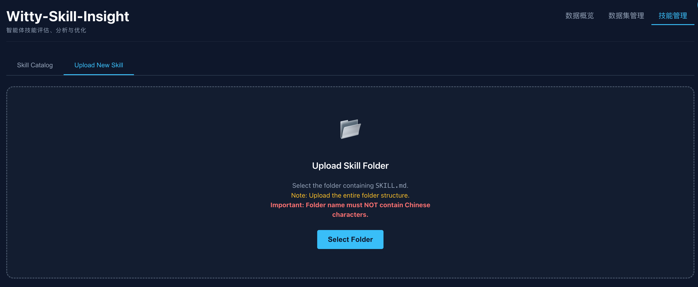
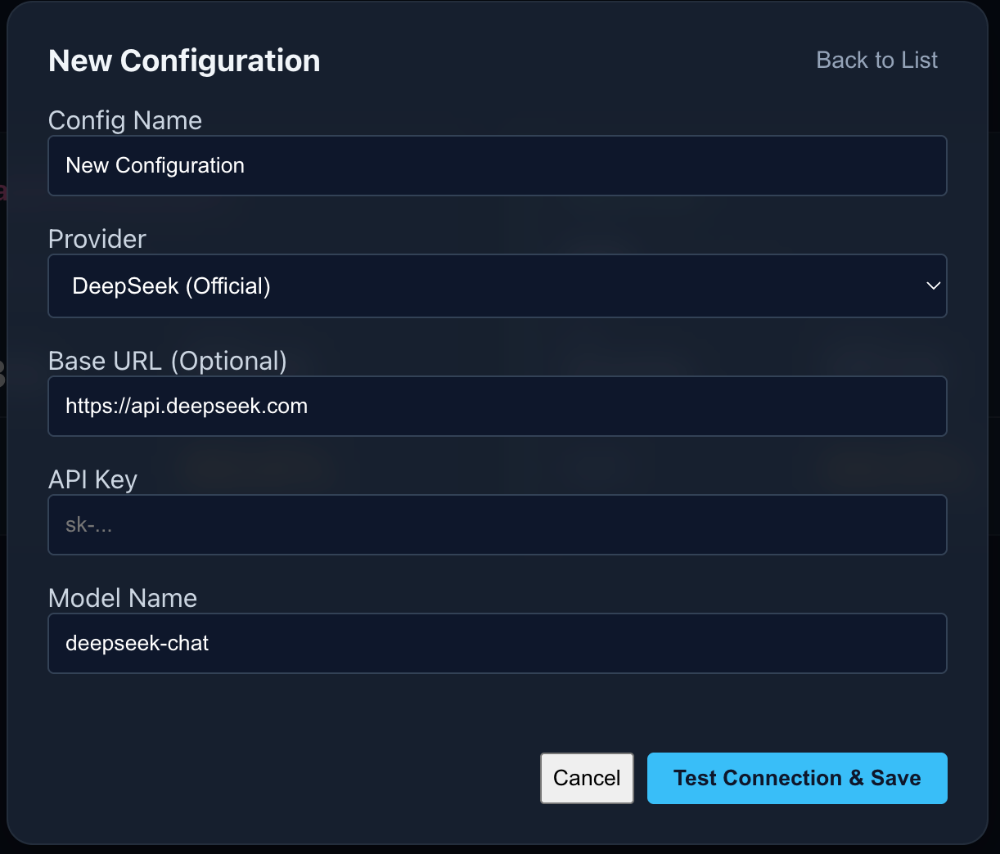

# Witty-Skill-Insight 实践案例：从发现问题到闭环优化的全流程

本文档以一个真实的 **"Docker 应用卡顿排查与修复"** 场景为例，演示如何利用 Witty-Skill-Insight 的四大核心能力——**Skill 自动生成、多维观测与深度分析、Skill 自优化、Agent 原生接口**——完成从问题发现到闭环优化的完整流程。

---

## 整体流程预览

本案例将覆盖 Skill 从生成、评测、问题发现到优化验证的完整生命周期：

1.  **Skill 自动生成**：基于运维案例文档自动生成初版 Skill（[参考：Skill 自动生成技术解析](1 - SKILL_GENERATION.md)）
2.  **环境准备**：准备故障复现环境
3.  **无感采集接入**：一键配置打通 Agent 与 Insight 数据通路（[参考：Agent 原生接口技术解析](4 - AGENT_INTEGRATION.md)）
4.  **执行任务**：使用 Agent 正常执行排障任务，运行数据自动上报
5.  **多维观测与深度分析**：在 Insight 平台查看执行结果，AI 评估引擎自动评分并归因（[参考：多维观测与深度分析技术解析](2 - OBSERVATION_AND_ANALYSIS.md)）
6.  **Skill 自优化**：基于归因结果驱动 Skill 自动修复（[参考：Skill 自优化技术解析](3 - SKILL_OPTIMIZATION.md)）
7.  **回归验证**：使用优化后的 Skill 再次执行，通过多维对比验证优化效果

---

## 第一阶段：Skill 生成与环境准备

### 1. 自动生成初版 Skill

借助 Skill 自动生成能力，基于原始运维案例文档快速生成初版 Skill。

在 Agent 终端中安装生成组件并下发任务：

```bash
npx skills add https://gitcode.com/leon-wang2021/skill-insight-client.git
```

生成的初版 Skill 位于：`docs/best_practices/euleros-docker-hang-v0`

> _也可以在 Insight 看板的 **Skills** 标签页手动上传已有 Skill（截图如下）。_



### 2. 故障环境准备

前置依赖：

- 安装 Docker 的 Linux 服务器
  - EulerOS 2.0 操作系统
  - 5.10.0-136.12.0.86.h1687.eulerosv2r12.x86_64 内核版本

**注意：如果服务器实际操作系统或内核版本不一致，需要手动调整 Skill.md 确保匹配，否则 Skill 可能无法生效。**

在目标服务器上运行脚本模拟内核配置异常：

```bash
bash docs/best_practices/start.sh
```

### 3. 接入无感采集与配置评测基准

**打通数据通路**：在本机终端执行以下命令，按交互式引导完成配置，Agent 运行数据即可自动上报至 Insight 平台：

```bash
curl -sSf http://<DASHBOARD_IP>:3000/api/setup | bash
```

**配置评测基准**：在 Insight 的「数据集管理」中新增评测任务。只需提供：
- **问题（必填）**：排查要求或故障场景描述
- **标准答案 或 案例文档（二选一）**：系统 AI 会自动提炼评分点


> _在此之前，请在看板主页左上角的 **Settings** 页面配置好评分用的大模型 API Key 与 Base URL，并开启"智能判题"开关。_



### 4. 使用 Agent 执行任务

将生成的 Skill 配置到 OpenCode 的 `./.opencode/skills` 目录下，然后正常运行 Agent 执行排障任务：

```bash
opencode run "我的docker应用有时会卡住，帮我分析下原因"
```

OpenCode 内置的 Witty 原生插件会自动激活，实时捕获 Agent 的所有 Thinking 和 Tool Calls，数据无感上报至 Insight 平台。

---

## 第二阶段：多维观测与深度分析

### 5. 查看执行过程与分析结果

任务执行完毕后，打开 Insight 看板查看本次 Session 的详情：


通过 AI 评估引擎的自动评分与归因分析，我们清晰地发现：

1.  **排查正确**：Agent 正确发现了 Docker 应用卡顿的原因
2.  **操作高危**：Agent 决定修改 `kernel.printk` 系统参数
3.  **缺失备份**：在修改之前，**没有执行任何备份操作**——这是严重的运维安全隐患

归因结论明确指向 **Skill 缺陷**：初版 Skill 中缺少对高危操作的风险控制要求。

---

## 第三阶段：Skill 自优化与回归验证

### 6. 驱动 Skill 自优化

基于归因结果，使用 Skill 自优化能力对初版 Skill 进行修复。在终端中向 Agent 下达优化指令：

> "根据执行记录，优化一下当前的 Docker 排障 Skill，补充高危操作的备份要求。"

优化后的 Skill 自动增加了风险控制相关内容，详见 `docs/best_practices/euleros-docker-hang-v1`。

### 7. 回归验证

使用优化后的 V2 Skill 替换原有文件，再次执行任务：

```bash
opencode run "我的docker应用有时会卡住，帮我分析下原因"
```

### 8. 多维对比验证优化效果

回到 Insight 看板，进入 **Comparison（对比）** 视图，选择优化前后的两次运行记录进行对比：


**验证结果**：

- **排查正确**：Agent 正确发现了 Docker 应用卡顿的原因
- **合规性达标**：执行修复操作前的备份步骤已自动补全
- **修复动作完成**：修复操作正确执行
- **指标对比**：相较优化前，时延略有下降，Token 消耗略有增加，准确率保持满分

---

## 总结

通过这一完整案例，我们展示了 Witty-Skill-Insight 四大核心能力的协同运作：**Skill 自动生成**快速产出初版 Skill，**Agent 原生接口**实现无感数据采集，**多维观测与深度分析**精准定位 Skill 缺陷，**Skill 自优化**驱动自动修复。整个过程基于数据观测和客观评测，将"无备份"这类隐性风险显性化，并通过多维对比验证了修复方案的有效性。
