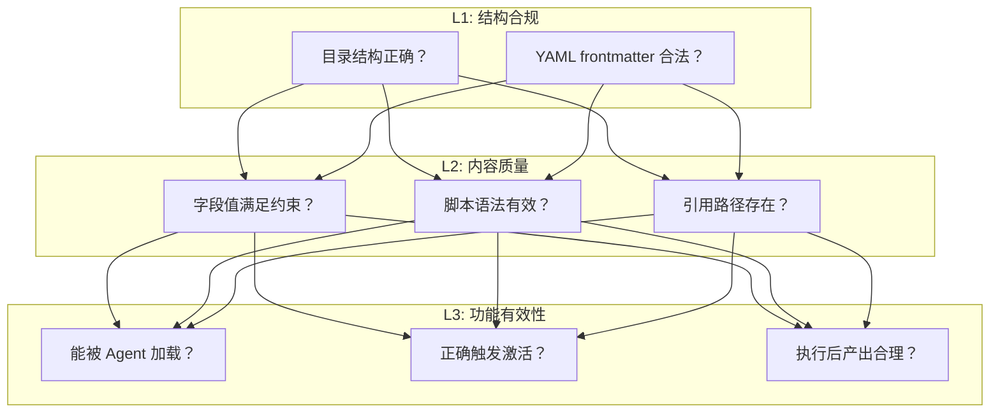

# Skill Generator 测试用例说明 (Test Cases)

本文档介绍了 `tests/skill-generator/cases/` 目录下现有的四个核心自动化测试用例，并提供了示例用法。

## 测试 case 总览

| 测试 ID | 目录名称 | 输入类型 | 场景路由 | 核心验证点 |
|---|---|---|---|---|
| **fault-pattern-network** | `fault-pattern-network` | MarkDown 表格 | `fault-diagnosis` | 结构化故障模式 -> 排查 Skill 的标准生成。 |
| **fault-pattern-security** | `fault-pattern-security` | MarkDown 表格 | `fault-diagnosis` | 多实例、大列表（19个模式）的归纳与生成能力。 |
| **fault-pdf-docker-hang** | `fault-pdf-docker-hang` | PDF 文档 | `fault-diagnosis` | 非结构化 PDF 文档的解析、知识提取与 Skill 转换。 |
| **fault-multi-doc-disk** | `fault-multi-doc-disk` | 本地Markdown群组 | `fault-diagnosis` | 多篇关于同一服务的历史排障文档的知识提取与特征总结。 |
| **general-description-git** | `general-description-git` | 纯文本描述 | `general` | 通用场景路由：根据主题描述（无具体文档）生成规范 Skill。 |

---

## 测试前准备 (Preparation)

由于测试脚本需要使用 `.opencode/skills/skill-generator` 技能，在首次运行测试前，请确保已将最新的技能代码同步至正确位置。

你可以使用项目自带的设置脚本：

```bash
# 自动同步 skills/skill-generator 到 .opencode/skills/
bash tests/skill-generator/setup_skill_generator.sh
```

或者手动将 `skills/skill-generator` 目录整体复制到 `.opencode/skills/skill-generator`。

---

## 示例用法

每个测试用例目录下都包含一个 `run.sh` 脚本，可独立运行完整流程（前置检查 -> 调用 opencode -> 验证产物）。

### 1. 运行单个测试用例

进入具体目录并执行 `run.sh`：

```bash
# 示例：运行网络故障模式测试
./tests/skill-generator/cases/fault-pattern-network/run.sh
```

### 2. 指定输出目录

默认产物会生成在 `tests/skill-generator/output/<case-name>` 目录下。你可以通过 `--output` 参数修改：

```bash
./tests/skill-generator/cases/fault-pattern-network/run.sh --output /tmp/my-skill-test
```

### 3. 仅运行合规性验证 (Validate Only)

如果你已经手动生成了某个 Skill 目录，想对其运行自动化合规检查，而不再次调用 AI 生成：

```bash
./tests/skill-generator/cases/fault-pattern-network/run.sh --validate-only /path/to/your/skill
```

---

## 用例详解

### A. fault-pattern-network (故障模式提取)
- **输入**：`input.md`（包含 IP 路由、iptables、MTU、DNS、网卡状态 5 个标准失效模型）。
- **预期**：Skill Generator 识别为 `fault-diagnosis` 场景，生成包含检查脚本（`check_*.sh`）和排查流程的完整 Skill 目录。

### B. fault-pattern-security (大规模数据处理)
- **输入**：`input.md`（包含 19 个关于用户认证、权限控制、防火墙、审计等安全类故障模式）。
- **预期**：测试在大规模输入下，生成器是否能正确处理 frontmatter（长度限制）以及是否能生成一致的脚本风格。

### C. fault-pdf-docker-hang (文档转换)
- **输入**：`Docker应用卡顿故障案例_修改版.pdf`。
- **预期**：测试对二进制 PDF 文件的读取能力，以及从自然语言描述的案例中提取核心排查逻辑并转化为 Skill 指令。

### D. fault-multi-doc-disk (多文档总结提取)
- **输入**：`input.md`（引用了多篇具体的排障案例 Markdown 文件）。
- **预期**：测试模型同时读取多篇关于硬盘故障案例的归纳能力，提取共同的 Failure Pattern 并生成通用 Skill。

### E. general-description-git (通用场景路由)
- **输入**：无文件，仅 Prompt："帮我做一个 Git Commit 规范的 Skill"。
- **预期**：正确路由到 `general` 场景。生成器会启动一个简单的 Agent 驱动流程，完成需求理解并产出符合规范的 Skill。

---

## 测试验证分层设计 (Validation Framework)

由于生成器的产物是 markdown 和 shell 脚本等自由格式文档，自动化验证被设计为如下分层结构：



| 层级 | 验证什么 | 怎么验证 | 可自动化？ |
|---|---|---|---|
| **L1 结构合规** | 目录结构、frontmatter 格式 | 脚本检查（正则/YAML 解析） | ✅ 完全自动化 |
| **L2 内容质量** | 字段约束、脚本语法、路径合法性 | 脚本检查 + bash -n | ✅ 大部分自动化 |
| **L3 功能有效性** | Agent 能否正确使用 | Agent 实际加载 + 烟雾测试 | ⚠️ 半自动（需要 Agent 环境） |

测试框架中的 `validate_skill.sh` 脚本统一封装了核心的 L1 和 L2 的自动化验证，所有测试用例的 `run.sh` 在生成完毕后都会自动调用它。具体的检查项如下：

**L1 检查项:**
  ✓ SKILL.md 存在
  ✓ YAML frontmatter 可解析
  ✓ name 字段: kebab-case, ≤64 字符
  ✓ description 字段: 100~1024 字符
  ✓ SKILL.md ≤ 500 行

**L2 检查项:**
  ✓ keywords 是数组且非空
  ✓ scripts/*.sh 语法检查 (bash -n)
  ✓ references/ 下的引用路径在 SKILL.md 中被提及
  ✓ 无空目录

**L3 (可选，需联调 Agent 环境):**
  ✓ 复制到 .opencode/skills/ 后 Agent 能正确加载并识别

> [!TIP]
> 运行后的详细生成日志和验证报告将直接在终端输出。如果某层验证失败，对应的 `run.sh` 将会被中断并返回非零退出码。
